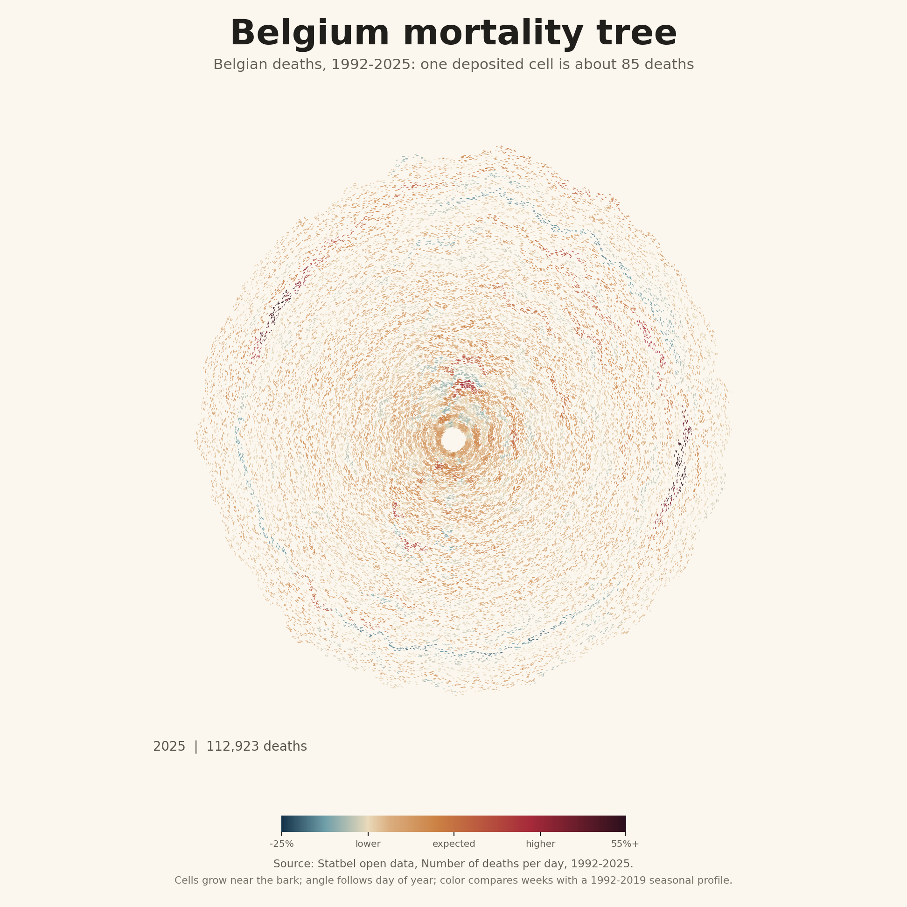

# Mortality Rings

Create dendrochronology-inspired mortality charts and animations from daily death counts.

The default example downloads Statbel's Belgian open-data file and turns daily deaths into a simulated tree section. Years grow from the center outward. Time of year bends around the trunk. Deaths are rendered as small deposited cells: by default, each cell represents about 85 deaths.

The design is inspired by Pedro Cruz's [Simulated Dendrochronology](https://pmcruz.com/dendrochronology/) and the team's VISAP paper, [Process of simulating tree rings for immigration in the U.S.](https://pmcruz.com/download/portfolio-camera-ready.pdf). Cells are deposited near the evolving bark, then local growth pushes the outline outward. For Belgium mortality, the trunk quietly records seasonality, COVID waves, and heat-wave periods as density, color, and shape.



Animated preview: [Belgium mortality tree GIF](examples/belgium_mortality_tree_1992_2025.gif)

## Install

```bash
python -m venv .venv
.venv\Scripts\activate
pip install -e .
```

On macOS/Linux, activate with `source .venv/bin/activate`.

## Quick Start

Generate the Belgian chart directly from Statbel:

```bash
mortality-rings --statbel --output-dir outputs/belgium --name belgium_mortality_tree_1992_2025
```

This writes:

- `belgium_mortality_tree_1992_2025.png`
- `belgium_mortality_tree_1992_2025.gif`
- `belgium_mortality_tree_1992_2025.mp4`, when ffmpeg is installed
- `weekly_mortality_summary.csv`

## Use Your Own Data

Your input needs one date column and one numeric count column. CSV, TXT, and ZIP files containing one CSV/TXT file are supported.

```bash
mortality-rings ^
  --input path/to/daily_deaths.csv ^
  --date-column date ^
  --count-column deaths ^
  --sep "," ^
  --title "Mortality tree" ^
  --baseline-start 2015 ^
  --baseline-end 2019 ^
  --output-dir outputs/custom
```

For European day-first dates, add `--dayfirst`.

## Why This Encoding?

Cells are sampled from daily deaths and deposited near the current outer edge of the trunk. Their angle follows the day of year, with enough jitter to avoid visible bins. More deaths means more cells and more local outward growth.

Color shows seasonal excess. The tool first learns a baseline seasonal profile from the selected reference years, then scales that profile to each year's total deaths. This keeps the cell count tied to raw mortality volume while using color to identify unusual weeks within the year's own seasonal rhythm.

The output intentionally avoids visible axes, gridded sectors, and rectangular containers. The months and years are encoded through the growth process itself: older cells remain closer to the pith, newer cells grow toward the bark, and seasonal time bends around the trunk.

## Useful Options

```bash
mortality-rings --help
```

Common settings:

- `--baseline-start` and `--baseline-end`: reference years for seasonal medians.
- `--first-year` and `--last-year`: visible year range.
- `--clip-low` and `--clip-high`: color-scale clipping bounds as proportions.
- `--people-per-cell`: deaths represented by one cell.
- `--seed`: deterministic cell placement seed.
- `--cell-growth` and `--ring-rest`: organic growth styling.
- `--cell-min-length` and `--cell-max-length`: rendered dash-cell size.
- `--no-gif` or `--no-mp4`: skip animation formats.
- `--fps`: animation frame rate.
- `--title` and `--subtitle`: visible chart text.

## Data Source

The Belgian example uses Statbel open data: [Number of deaths per day](https://statbel.fgov.be/en/open-data/number-deaths-day).

Statbel's broader mortality page reported 112,923 deaths in Belgium in 2025, matching the latest daily open-data file used by this project.

## License

Code is released under the MIT License. Check the license terms of your data source before publishing derived charts.
