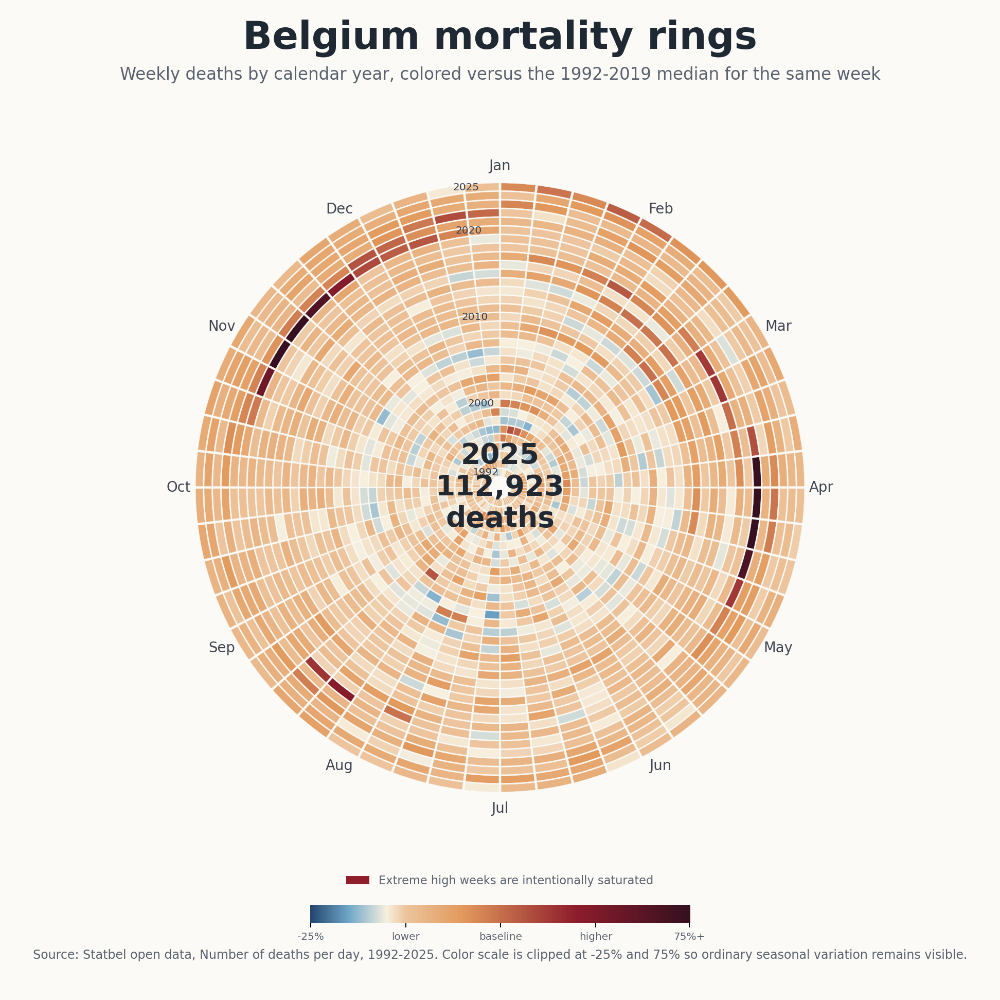

# Mortality Rings

Create radial "tree ring" charts and animations from daily mortality data.

The default example downloads Statbel's Belgian open-data file, aggregates daily deaths into 52 calendar-week slices per year, and colors each cell against a pre-pandemic seasonal baseline. The result is a compact visual history where normal seasonality stays readable while exceptional periods, such as 2020 COVID waves and heat-wave weeks, remain visible.



## Install

```bash
python -m venv .venv
.venv\Scripts\activate
pip install -e .
```

On macOS/Linux, activate with `source .venv/bin/activate`.

## Quick Start

Generate the Belgian chart directly from Statbel:

```bash
mortality-rings --statbel --output-dir outputs/belgium
```

This writes:

- `belgium_mortality_rings_1992_2025.png`
- `belgium_mortality_rings_1992_2025.gif`
- `belgium_mortality_rings_1992_2025.mp4`, when ffmpeg is installed
- `weekly_mortality_summary.csv`

## Use Your Own Data

Your input needs one date column and one numeric count column. CSV, TXT, and ZIP files containing one CSV/TXT file are supported.

```bash
mortality-rings ^
  --input path/to/daily_deaths.csv ^
  --date-column date ^
  --count-column deaths ^
  --sep "," ^
  --title "Mortality rings" ^
  --baseline-start 2015 ^
  --baseline-end 2019 ^
  --output-dir outputs/custom
```

For European day-first dates, add `--dayfirst`.

## Why This Encoding?

Each ring is one calendar year. Each segment is a 52-slice week-of-year bucket. Color shows percentage difference from the median value for the same week during the selected baseline period.

That baseline-relative encoding avoids a common problem with mortality charts: a large shock year can dominate the color scale and flatten all other seasonal information. By clipping the color scale by default at `-25%` and `+75%`, the chart keeps ordinary variation visible while still making extreme weeks unmistakable.

## Useful Options

```bash
mortality-rings --help
```

Common settings:

- `--baseline-start` and `--baseline-end`: reference years for seasonal medians.
- `--first-year` and `--last-year`: visible year range.
- `--clip-low` and `--clip-high`: color-scale clipping bounds as proportions.
- `--no-gif` or `--no-mp4`: skip animation formats.
- `--fps`: animation frame rate.
- `--title` and `--subtitle`: visible chart text.

## Data Source

The Belgian example uses Statbel open data: [Number of deaths per day](https://statbel.fgov.be/en/open-data/number-deaths-day).

Statbel's broader mortality page reported 112,923 deaths in Belgium in 2025, matching the latest daily open-data file used by this project.

## License

Code is released under the MIT License. Check the license terms of your data source before publishing derived charts.
